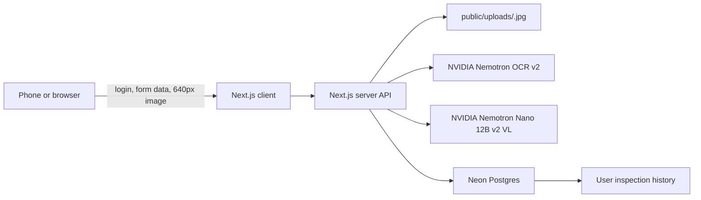

# Equipment inspection web app design

## Purpose

Provide a mobile-friendly, LAN-accessible web app that lets authenticated users upload an equipment photo, run OCR and/or visual anomaly inspection through NVIDIA APIs, and review their own past inspections.

## Scope

- Email/password registration, login, logout, and user-scoped sessions.
- A new inspection form with a camera-oriented image picker.
- Inspection modes: OCR, anomaly inspection, or both.
- Local file persistence in `public/uploads`.
- Inspection persistence in Neon Postgres.
- A dashboard showing the six most recent inspections and an inspection-detail view.
- A development command that binds the app to `0.0.0.0` for devices on the same Wi-Fi network.

Out of scope: social login, administrator roles, automated background queues, cloud/private object storage, and multi-image inspection.

## Architecture

The Next.js application contains both the UI and server API routes. The browser never receives database credentials, the NVIDIA API key, or session-secret material.



The client resizes the selected photo so its longest edge is 640 pixels before upload. The server validates the uploaded type and size, writes the resulting image with a cryptographically random UUID filename, calls the selected model adapter(s), and writes one inspection row. A server-side ownership predicate is applied to every history and detail query.

## Authentication

- `users`: immutable user ID, unique normalized email, password hash, creation timestamp.
- `sessions`: opaque random token hash, user ID, expiry, creation timestamp.
- Login sets the unencrypted session token only in a `Secure` (in production), `HttpOnly`, `SameSite=Lax` cookie. The database stores only its hash.
- Passwords are salted and hashed with a secure password-hashing implementation; plain-text passwords are never stored or logged.
- Registration rejects duplicate email addresses. Login uses a generic invalid-credentials message to avoid user enumeration.

## Inspection data model

`inspections` contains:

- ID and owner user ID.
- Image path beneath `public/uploads`.
- Mode: `ocr`, `visual`, or `both`.
- User-supplied criterion text, nullable for OCR-only runs.
- OCR result JSON, nullable unless OCR runs.
- Visual result JSON, nullable unless visual inspection runs.
- Status: `completed`, `partial`, or `failed`.
- Failure-safe user-visible error summary, nullable.
- Created timestamp.

OCR JSON follows this schema:

```text
equipmentNameOrId, observedAt, readings[{label, value, unit}],
statusMessages[], otherText[], confidence
```

Visual JSON follows this schema:

```text
verdict(normal | abnormal | indeterminate), summary,
findings[{locationDescription, severity, evidence}],
criteriaAssessment, confidence
```

The server prompts each model to return only JSON matching its corresponding schema, validates and safely parses the result, and reports model or parsing failures without losing a successful sibling result in `both` mode.

## UI

Unauthenticated visitors see sign-in and sign-up forms. Authenticated users see a mobile-first dashboard with their email address and logout control.

The new-inspection form includes:

- A file input with `accept="image/*"` and `capture="environment"` to offer the rear mobile camera.
- Local image preview.
- Mode selector: OCR, anomaly inspection, or both.
- An optional criterion field; it is used by anomaly inspection and is optional for OCR-only inspection.
- A submit button with pending and error states.

The dashboard renders six latest user-owned inspection cards. Each card shows a thumbnail, mode, state, summary, and timestamp. A detail page shows the stored image and the complete structured result. No route returns another user's records.

## Failure handling

- Reject unsupported image types, missing files, and size-limit violations before file persistence or model execution.
- If image resizing or upload fails, report the error and do not create an inspection.
- If a selected model fails, record the inspection as `failed`; if one model fails in `both` mode, retain the other result and record `partial`.
- Never expose API keys, database errors, stack traces, or raw provider errors to the browser.

## Configuration and LAN operation

The server reads only these environment variables:

- `NVIDIA_API_KEY`
- `DATABASE_URL`
- `SESSION_SECRET`

An `.env.example` documents their names without values. The development workflow documents running Next.js with a `0.0.0.0` host and opening `http://<PC-LAN-IP>:3000` from a phone on the same Wi-Fi. Firewall access remains the local operator's responsibility.

`public/uploads` is a statically served directory. UUID filenames reduce guessability but do not provide access control. This is acceptable for the requested LAN-scoped first release; a later internet-facing deployment must migrate images to private object storage served through an authorized endpoint.

## Verification

- Unit tests: model-result parsing, image longest-edge resize rule, authentication/session helpers, and ownership predicates.
- Integration tests: registration, login, creating each inspection mode with mocked NVIDIA responses, failure/partial states, and a user being unable to list or fetch another user's inspection.
- Manual smoke test: start on `0.0.0.0`, open from a same-Wi-Fi phone, use camera capture, complete a test inspection, and confirm it appears in the latest-six list after refresh.
