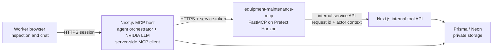

# MCP Host and Maintenance Server Design

## Goal

Turn the equipment inspection application into an internal MCP host. Its
NVIDIA Nemotron agent automatically analyzes a completed inspection and can
continue the same work through a worker chat interface. A separately developed
MCP server exposes a deliberately small set of equipment and maintenance tools
and is deployed to Prefect Horizon.

## Scope

Phase 1 covers:

- Automatic inspection-to-maintenance workflow and a worker chat agent.
- NVIDIA API-hosted Nemotron as the application-only LLM layer.
- A server-side TypeScript MCP client in this application.
- A separate Python/FastMCP repository, `equipment-maintenance-mcp`, deployed
  to Prefect Horizon through remote HTTP transport.
- Inspection/equipment/evidence lookup, maintenance request creation, and
  maintenance request status transitions.
- Auditable, idempotent state changes made by either an automatic run or chat.

Phase 1 excludes external MCP clients, external CMMS/ERP connectors,
administrator document/permission tools, and Graph RAG.

## Architecture



The browser never receives an NVIDIA key, Horizon URL credential, MCP token,
database credential, or internal service token. The host keeps the LLM and MCP
client server-only. The MCP server has no direct database connection: it is a
thin, independently deployable protocol adapter that calls the application's
internal service API. That API remains the source of truth for validation,
authorization, Prisma writes, and private file access.

Prefect Horizon supports remote HTTP FastMCP deployments. Its server
environment holds the MCP-side configuration; the application connects as the
only Phase-1 client. See the official Prefect guide:
<https://docs.prefect.io/v3/how-to-guides/ai/use-prefect-mcp-server>.

## Authentication and Trust

Version 1 uses a rotation-capable service Bearer token between the Next.js host
and the Horizon server. Both components accept a current and previous token for
an explicit overlap period. The adapter boundary makes a future OAuth transport
replacement possible without changing tool names or application authorization.

Every MCP tool input must carry an opaque request ID plus the authenticated
actor and equipment context supplied by the host. The MCP server must not trust
actor IDs supplied by model text. The internal application API reauthorizes the
actor for every call, including owner-versus-shared-equipment visibility and
legal maintenance state transitions.

## Agent Execution

Two entry points share one orchestration policy:

1. After a saved inspection, the host retrieves equipment history and RAG
   evidence, evaluates deterministic risk rules, asks NVIDIA Nemotron only for
   a structured cited explanation, and creates a maintenance request when the
   approved policy says to do so.
2. In worker chat, the agent may query the same evidence or immediately create
   and update maintenance requests.

The LLM selects tools and explains evidence. It never makes the final access,
state-transition, deduplication, or notification decision. Tool inputs are
strict schemas; the LLM cannot supply SQL, filesystem paths, raw URLs, or
unvalidated identifiers. Existing deterministic urgent/repeat/trend rules and
citation validation continue to gate automatic actions.

## MCP Tools

The first server release has six tools.

| Tool | Purpose | Effect |
| --- | --- | --- |
| `list_equipment` | List equipment visible to the actor. | Read |
| `get_equipment_history` | Get completed inspection, trend, and maintenance history. | Read |
| `get_inspection_evidence` | Get authorized inspection facts and citation metadata. | Read |
| `search_evidence` | Retrieve equipment-bounded document and inspection evidence. | Read |
| `create_maintenance_request` | Create or reuse an in-app maintenance request with evidence and actions. | Write |
| `update_maintenance_request_status` | Move a request through `new`, `acknowledged`, and `completed`. | Write |

Write tools execute immediately, including from chat. They require an
idempotency key and return the resulting request plus whether it was newly
created or reused. The internal API validates all status transitions and writes
using an authorization predicate in the state-changing operation itself.

## Data and Audit Model

`maintenance_notifications` becomes the Phase-1 maintenance request record;
no external CMMS is called. Add an append-only `mcp_tool_audit_logs` record for
every attempted tool call with:

- request ID, MCP call ID, actor ID, equipment ID, and trigger (`inspection` or
  `chat`);
- tool name, sanitized validated input, result category, idempotency key, and
  timestamps;
- inspection/trend IDs, model name/version, and citation IDs when applicable;
- before/after request status for writes; and
- a safe failure code without tokens, prompts, image bytes, or raw secrets.

The host returns an honest outcome to the worker. If Horizon or the internal
tool service is unavailable, an inspection still saves. The host records a
pending retryable automation event and reports that maintenance execution is
pending; it does not claim a request was created.

## Separate MCP Repository

`equipment-maintenance-mcp` is a Python repository with:

```text
server.py                 FastMCP app and tool registration
tools/                    Pydantic input/output schemas and tool adapters
app_client/               authenticated Next.js internal API client
tests/                    auth, schema, idempotency, and error mapping tests
contracts/                versioned shared JSON Schemas
pyproject.toml            pinned runtime dependencies
prefect.yaml              Horizon deployment configuration
```

The application owns matching TypeScript schemas generated or checked against
the versioned JSON contracts. CI on both repositories runs contract tests so a
server deployment cannot silently drift from the host client.

Horizon configuration contains only `APP_INTERNAL_API_URL`, current/previous
service tokens, and request timeout settings. NVIDIA and database credentials
remain exclusively in the application environment.

## Reliability and Testing

- Read tools use short deadlines and safe error envelopes.
- Write tools use idempotency keys, bounded retry for transport failures, and
  no retry after a definitive validation/authorization error.
- Automatic maintenance execution is queued/retryable when MCP transport is
  unavailable; it is never represented as complete until the internal API
  commits it.
- Contract tests verify MCP JSON Schema compatibility in both repositories.
- Integration tests mock Horizon transport but exercise host authorization,
  tool result validation, duplicate writes, audit writes, and failed transport
  behavior.
- Horizon deployment smoke tests use a restricted service token and verify the
  six tools are discoverable; production credentials are never used in tests.

## Deferred Work

The following remain out of scope until a later design cycle: external MCP
clients/OAuth login, CMMS/ERP connector tools, document administration tools,
equipment-sharing management tools, Graph RAG, and additional third-party MCP
servers.

## Acceptance Criteria

- A completed high-risk inspection can create exactly one in-app maintenance
  request through the MCP server, with citations and audit records.
- A worker chat can read only its authorized equipment evidence and immediately
  create or advance an authorized maintenance request.
- No browser-visible source includes MCP, service, NVIDIA, or database secrets.
- A Horizon outage leaves inspections intact and creates a retryable pending
  automation record rather than a false success.
- The FastMCP server builds and deploys from its own repository, while contract
  tests keep both repositories compatible.
